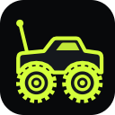
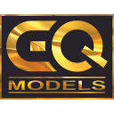

<!-- GitHub profile README for SAM-Designs-Studio -->

# Hi, I'm Sam

**Web Designer & Front-End Developer**

I design and build fast, responsive, bilingual websites in Arabic and English for businesses, brands and online stores.

### 🛠️ What I do

- **Business & company websites** — clean, credible sites that explain what you do and turn visitors into enquiries
- **Online store front-ends** — product catalogues, filters, search, cart and checkout flows
- **Landing pages** — focused, fast pages built around one goal
- **Arabic + English sites** — full right-to-left / left-to-right switching done properly, not as an afterthought
- **Responsive & accessible** — looks right and works on every screen, from phones to wide monitors

### 🧰 Tools

### ⭐ Featured work

| | Project | What it shows |
|---|---|---|
|  **[RC World Egypt](https://sam-designs-studio.github.io/rc-world-egypt/)** — website for a real RC shop in Sheikh Zayed, Egypt *(live client site)* · [code](https://github.com/SAM-Designs-Studio/rc-world-egypt) | Bilingual shop site with the owner's real photos, catalogue with brand & scale filters, inquiry list that hands off to WhatsApp, photo gallery with lightbox |
|  **[Nanova Paints](https://sam-designs-studio.github.io/nanova-paints/)** — nano-technology paint manufacturer *(concept project)* · [code](https://github.com/SAM-Designs-Studio/nanova-paints) | Interactive color studio, paint quantity calculator, before/after slider, product catalogue, projects gallery, Arabic/English toggle |
|  **[EQ Models Trading](https://www.eqmodelstrading.com)** — scale & architectural model company, Qatar *(live site)* | Company website built with Google Sites: project gallery of 14 landmark models, services, R/C section |

<table>
<tr>
<td></td>
<td></td>
</tr>
</table>

### 📫 Work with me

Available for freelance projects on **[Mostaql](https://mostaql.com)**.

---

## مرحبًا، أنا سام

**مصمم ومطوّر واجهات مواقع**

أصمم وأطوّر مواقع سريعة ومتجاوبة باللغتين العربية والإنجليزية للشركات والعلامات التجارية والمتاجر الإلكترونية.

### 🛠️ خدماتي

- **مواقع الشركات والأعمال** — مواقع واضحة وموثوقة تعرّف بنشاطك وتحوّل الزوار إلى عملاء
- **واجهات المتاجر الإلكترونية** — عرض المنتجات والفلترة والبحث وسلة الشراء وإتمام الطلب
- **صفحات الهبوط** — صفحات سريعة ومركّزة مبنية حول هدف واحد
- **مواقع ثنائية اللغة** — تبديل كامل ومتقن بين اتجاه العربية واتجاه الإنجليزية
- **تصميم متجاوب وسهل الاستخدام** — يظهر ويعمل بشكل صحيح على جميع الشاشات من الجوال حتى الحاسوب

### ⭐ أبرز الأعمال

- ‏ **[RC World Egypt](https://sam-designs-studio.github.io/rc-world-egypt/)** — موقع لمتجر حقيقي لسيارات وطائرات التحكم عن بعد في الشيخ زايد *(موقع منشور لعميل)*: صور حقيقية من المحل، وكتالوج بفلترة حسب الماركة والمقاس، وقائمة طلب تتحول إلى رسالة واتساب، ومعرض صور، وتبديل بين العربية والإنجليزية.
- ‏ **[Nanova Paints](https://sam-designs-studio.github.io/nanova-paints/)** — موقع لشركة دهانات بتقنية النانو *(مشروع تصميمي تجريبي)*: استوديو ألوان تفاعلي، وحاسبة لكمية الدهان، وشريط مقارنة قبل وبعد، وكتالوج منتجات، ومعرض مشاريع، وتبديل بين العربية والإنجليزية.
- ‏ **[EQ Models Trading](https://www.eqmodelstrading.com)** — موقع شركة لصناعة المجسمات المعمارية والنماذج المصغّرة في قطر *(موقع منشور)*: معرض يضم أربعة عشر مشروعًا بارزًا، وصفحات الخدمات والتحكم عن بعد.

### 📫 تواصل معي

متاح لتنفيذ مشاريعك عبر **[منصة مستقل](https://mostaql.com)** — تواصل معي هناك لمناقشة فكرة موقعك.

